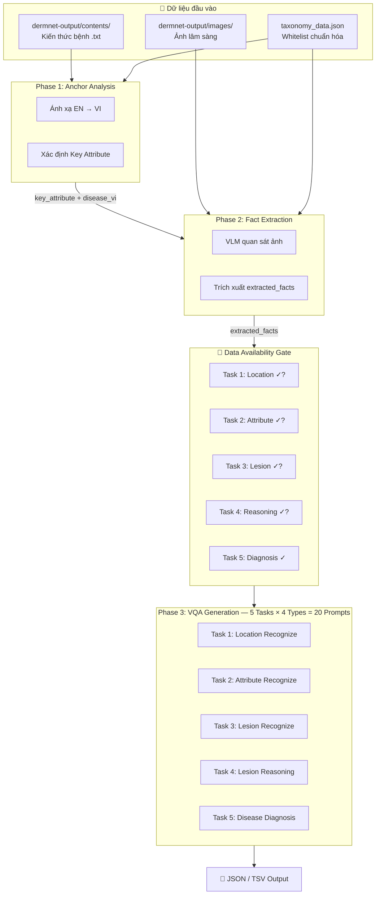

# DermNet VQA Pipeline — Phase 1: Sinh dữ liệu VQA Da liễu

> **Cách dùng hiện tại (2026-10-03): Phase 1 lưu bộ prompt, không chạy pipeline Python bên dưới.**
> Mở [bộ 40 prompt tiếng Việt v3](prompts/README_VI.md): 20 bản cho bài báo và 20 bản dùng với Codex đọc ảnh trực tiếp.
> Bộ mới kế thừa bản v2 trong `outputs`, đã sửa theo các trường hợp duyệt trước đó; không import `Phase_2/config`, không dùng `generate_vqa()`.
> Các phần pipeline, `config/prompts.yaml` và module trong `tasks/` bên dưới là tài liệu/code lịch sử, không phải prompt đang khuyến nghị dùng. Chưa triển khai subagent hay lịch chạy.

Pipeline tự động sinh bộ dữ liệu Visual Question Answering (VQA) tiếng Việt chuyên khoa da liễu, tương thích VLMEvalKit.

## 📋 Tổng quan Pipeline

Pipeline gồm 3 giai đoạn chính:



## 📂 Cấu trúc thư mục

```
Phase_1/
├── README.md                              # Hướng dẫn này
├── requirements.txt                       # Thư viện Python cần cài
├── taxonomy_data.json                     # Dữ liệu whitelist (parse từ docx)
├── DermNet_Canonical_Taxonomy.docx        # Tài liệu gốc whitelist
├── Prompt_final.docx                      # Tài liệu gốc mô tả nghiệp vụ
│
├── config/
│   └── settings.yaml                      # Cấu hình paths, model, pipeline
│
├── taxonomy/
│   ├── __init__.py
│   └── taxonomy_loader.py                 # Load & query taxonomy_data.json
│
├── core/
│   ├── __init__.py
│   ├── vqa_base.py                        # VQAItem dataclass, helpers
│   └── data_gate.py                       # Data Availability Gate rules
│
├── loaders/
│   ├── __init__.py
│   ├── data_loader.py                     # Load ảnh, file kiến thức bệnh
│   └── config_loader.py                   # Load YAML config
│
├── tasks/                                 # ⭐ Mỗi task = 1 folder riêng
│   ├── __init__.py
│   ├── phase1_anchor_analysis/            # Phase 1: Xác định key attribute
│   │   ├── __init__.py
│   │   └── prompt.py
│   ├── phase2_fact_extraction/            # Phase 2: Trích xuất facts từ ảnh
│   │   ├── __init__.py
│   │   └── prompt.py
│   ├── task1_location_recognize/          # Nhóm 1: Vị trí giải phẫu
│   │   ├── __init__.py
│   │   ├── prompt_1_1_multi_choice.py
│   │   ├── prompt_1_2_judgement.py
│   │   ├── prompt_1_3_short_answer.py
│   │   ├── prompt_1_4_fill_in_blank.py
│   │   └── PROMPT_GUIDE.md
│   ├── task2_attribute_recognize/         # Nhóm 2: Thuộc tính chỉ điểm
│   │   ├── __init__.py
│   │   ├── prompt_2_1_multi_choice.py
│   │   ├── prompt_2_2_judgement.py
│   │   ├── prompt_2_3_short_answer.py
│   │   ├── prompt_2_4_fill_in_blank.py
│   │   └── PROMPT_GUIDE.md
│   ├── task3_lesion_recognize/            # Nhóm 3: Tổn thương cơ bản
│   │   ├── __init__.py
│   │   ├── prompt_3_1_multi_choice.py
│   │   ├── prompt_3_2_judgement.py
│   │   ├── prompt_3_3_short_answer.py
│   │   ├── prompt_3_4_fill_in_blank.py
│   │   └── PROMPT_GUIDE.md
│   ├── task4_lesion_reasoning/            # Nhóm 4: Suy luận tổn thương
│   │   ├── __init__.py
│   │   ├── prompt_4_1_multi_choice.py
│   │   ├── prompt_4_2_judgement.py
│   │   ├── prompt_4_3_short_answer.py
│   │   ├── prompt_4_4_fill_in_blank.py
│   │   └── PROMPT_GUIDE.md
│   └── task5_disease_diagnosis/           # Nhóm 5: Chẩn đoán bệnh
│       ├── __init__.py
│       ├── prompt_5_1_multi_choice.py
│       ├── prompt_5_2_judgement.py
│       ├── prompt_5_3_short_answer.py
│       ├── prompt_5_4_fill_in_blank.py
│       └── PROMPT_GUIDE.md
│
├── scripts/
│   ├── run_full_pipeline.py               # 🚀 Script chính chạy pipeline
│   └── export_tsv.py                      # Xuất VQA → TSV (VLMEvalKit)
│
├── output/                                # Kết quả sinh VQA
│   ├── vqa/{disease_name}/                # VQA JSON theo bệnh
│   ├── dermnet_vqa_benchmark.tsv          # File TSV tổng hợp
│   └── progress.json                      # Theo dõi tiến độ
│
├── assets/                                # Few-shot examples (giữ nguyên)
│   ├── few_shot_image/
│   └── few_shot_knowledge/
│
└── test_demo/                             # Test case demo (giữ nguyên)
```

## 🚀 Hướng dẫn cài đặt & chạy

### 1. Cài đặt

```bash
cd /Users/binhminh/Desktop/DermNet_Dataset
pip install -r Phase_1/requirements.txt
```

### 2. Cấu hình API Key (nếu dùng LLM thực)

```bash
export OPENAI_API_KEY="your-api-key"
# hoặc
export GOOGLE_API_KEY="your-google-ai-key"
```

### 3. Chạy Pipeline

```bash
# Chạy toàn bộ pipeline
python Phase_1/scripts/run_full_pipeline.py

# Chạy thử (dry-run) — chỉ hiện thông tin, không sinh VQA
python Phase_1/scripts/run_full_pipeline.py --dry-run

# Chạy cho 1 bệnh cụ thể
python Phase_1/scripts/run_full_pipeline.py --disease "Acne vulgaris"

# Chạy lại tất cả (bỏ qua progress)
python Phase_1/scripts/run_full_pipeline.py --force
```

### 4. Xuất TSV

```bash
python Phase_1/scripts/export_tsv.py
```

## 📊 Bảng tổng hợp 20 Prompts

| Nhóm | Category | 1. Multi_choice | 2. Judgement | 3. Short_answer | 4. Fill_in_blank |
|------|----------|-----------------|--------------|-----------------|------------------|
| **Task 1** | Location_Recognition | `prompt_1_1` | `prompt_1_2` | `prompt_1_3` | `prompt_1_4` |
| **Task 2** | Attribute_Recognition | `prompt_2_1` | `prompt_2_2` | `prompt_2_3` | `prompt_2_4` |
| **Task 3** | Lesion_Recognition | `prompt_3_1` | `prompt_3_2` | `prompt_3_3` | `prompt_3_4` |
| **Task 4** | Lesion_Reasoning | `prompt_4_1` | `prompt_4_2` | `prompt_4_3` | `prompt_4_4` |
| **Task 5** | Diagnosis | `prompt_5_1` | `prompt_5_2` | `prompt_5_3` | `prompt_5_4` |

## 🚦 Data Availability Gate (Quy tắc bỏ qua)

| Task | Điều kiện bỏ qua |
|------|-------------------|
| Task 1 (Location) | `location == "Không xác định được trên ảnh"` hoặc `"Không đủ dữ liệu quan sát"` |
| Task 2 (Attribute) | `KEY_ATTRIBUTE` không có giá trị cụ thể hoặc ghi nhận `"không rõ"` |
| Task 3 (Lesion) | Không xác định được tổn thương cơ bản rõ ràng |
| Task 4 (Reasoning) | Thiếu `lesion` HOẶC `lesion_reasoning` |
| Task 5 (Diagnosis) | **Luôn khả dụng** (dùng `disease_name_vi`) |

## 📄 Định dạng đầu ra VQA (VLMEvalKit)

Mỗi VQA item là 1 JSON object:
```json
{
  "image_path": "/path/to/image.jpg",
  "category": "Location_Recognition",
  "type": "Multi_choice",
  "question": "Vùng cơ thể nào xuất hiện trong bức ảnh này?\nA. Mu bàn tay\nB. Cẳng chân\nC. Mặt\nD. Lưng",
  "answer": "C"
}
```

**Giá trị `type`**: `Multi_choice` | `Judgement` | `Short_answer` | `Fill_in_blank`

**Giá trị `category`**: `Location_Recognition` | `Attribute_Recognition` | `Lesion_Recognition` | `Lesion_Reasoning` | `Diagnosis`
